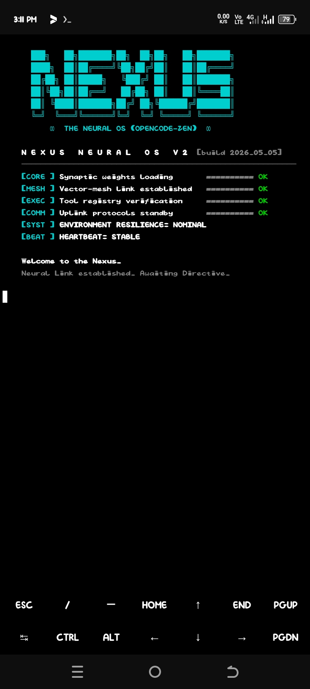

# Nexus — The Neural OS 🌌

<div align="center">



[](LICENSE)
[](https://www.python.org/)
[]()

**Nexus** is a self-hosted, autonomous AI coding agent designed as an AI Operating System for power users. Built for Termux and Linux, it provides a high-fidelity, sci-fi inspired CLI experience with real-time multi-agent orchestration.

[Report Bug](https://github.com/alpha-1-design/Nexus/issues) · [Contributing](./CONTRIBUTING.md)

</div>

---

## 🚀 Key Features

*   **Multi-Agent Governance:** Employs specialized sub-agents (Planner, Coder, Reviewer, Researcher) that collaborate in a shared team chat to solve complex tasks.
*   **Neural OS Core:** Built on a "Governor" pattern that manages the lifecycle of memory, tools, and orchestration subsystems.
*   **Real Memory Layer:** Facts, session history, and semantic (vector) recall are actually consulted on every turn — not just stored.
*   **382 Bundled Skills + 92-Server MCP Marketplace:** `nexus skill search`, `nexus mcp catalog/search/install` — a curated library ported from the community, available offline out of the box.
*   **Atmospheric TUI:** High-fidelity Textual terminal UI with a Claude Code-style boxed input prompt, slash-command autocomplete, and live thinking/tool panels.
*   **GIA Web Dashboard:** A dark, ChatGPT/LibreChat-style chat interface in the browser, with real token streaming, wired to the same agent core as the CLI.
*   **Offline-First & Local:** Designed for Termux/Mobile, Nexus is optimized for low-bandwidth, high-latency environments.
*   **Resilience Engine:** Self-correcting loop that proactively detects failures, analyzes logs, and improves agent performance through iteration.

---

## 🏗️ Architecture

Nexus operates on a multi-layer Neural OS architecture:
1.  **Orchestrator:** The primary agent lead that delegates tasks based on task complexity, with memory recall/persistence wired into every turn.
2.  **Vector-Mesh Memory:** A persistent SQLite-backed memory store providing long-term project context.
3.  **Resilience Layer:** A circuit-breaker and doctor module that monitors sub-agent health in real-time.
4.  **Plugin System:** A drop-in architecture for extending core OS capabilities.
5.  **GIA Dashboard:** A Flask-based web layer exposing the same agent core over HTTP/SSE, for a browser-based chat experience.

---

## 🛠️ Quick Start

```bash
# Clone the repository
git clone https://github.com/alpha-1-design/Nexus.git
cd Nexus

# Initialize Nexus (installs into an isolated venv under ~/.nexus,
# including the TUI and web dashboard extras)
bash install.sh

# Start the interactive agent (terminal UI)
nexus repl        # text REPL
nexus tui         # full Textual terminal UI

# Or launch the web dashboard (GIA) instead
nexus dashboard
```

**First run:** if no LLM provider is configured yet, Nexus walks you through
an interactive setup the first time you run a command that needs one
(`repl`, `tui`, `dashboard`, `agents`, `team`). Utility commands like
`nexus mcp catalog`, `nexus skill search`, and `nexus doctor` work
immediately without any provider configured. You can also skip the wizard
and configure directly with `nexus auth`.

**Optional extras** (not installed by `install.sh` by default): voice
(`pip install -e ".[voice]"`) and browser automation
(`pip install -e ".[browser]"`).

**Verify the install worked:**
```bash
nexus doctor       # full diagnostic report — dependencies, config, provider, git
nexus mcp catalog  # browse the bundled 92-server MCP marketplace
nexus skill search python   # search the bundled skill library
```

---

## 📜 Contributing & Community

We are building a decentralized ecosystem of intelligent tools. Whether you are building plugins or hardening the OS core, check out our [Contributing Guide](./CONTRIBUTING.md).

Distributed under the **MIT License**. Built for the Alpha-1 Ecosystem.
